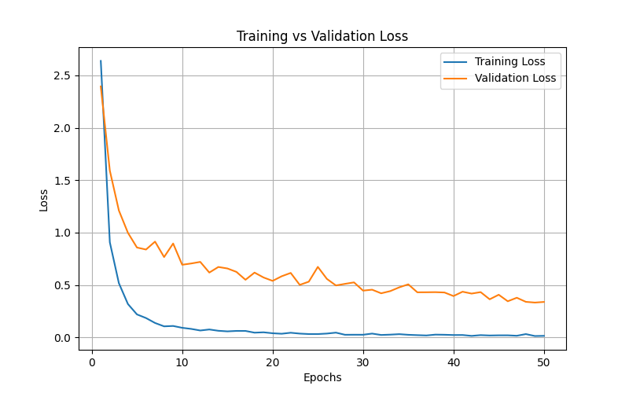
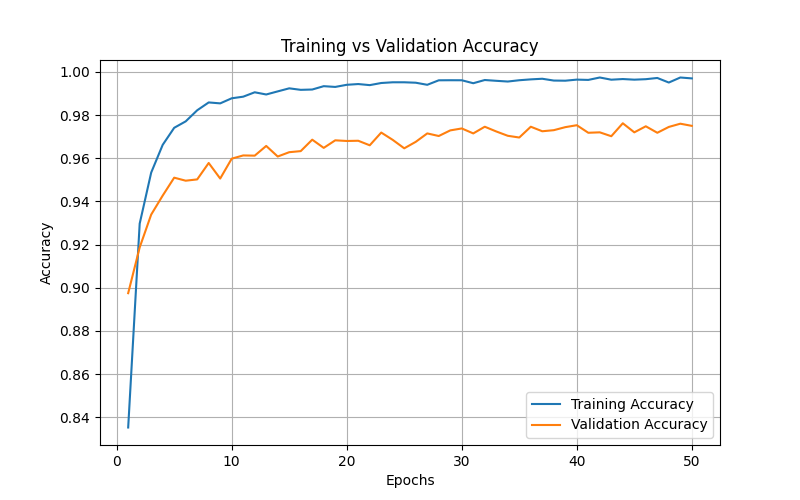

# Digit Recognition Neural Network
A neural network built from scratch in Python to classify handwritten digits, using a flattened pixel input, ReLU hidden layers, and Softmax output.

## Description
Digit Image Classifier is a machine learning project that implements a fully connected neural network (from scratch using CuPy, leveraging GPU acceleration for faster computations) to recognize handwritten digits.

* Input: flattened 28x28 grayscale images (784 values)
* Hidden layers: configurable with ReLU activations.
* Output: Softmax layer over 10 classes (digits 0–9).
* Optimizer: Adam with weight decay (L2 regularization).
* Includes training loss and accuracy visualization.

This project is meant for learning purposes, showing and teaching myself how to implement the forward pass, backpropagation, and optimization manually without relying on high-level frameworks like PyTorch or TensorFlow.

## Requirements & Installation
### Requirements
* Python version 3.9+
* Libraries:
  * `Numpy`
  * `Cupy`
  * `Pillow`
  * `Matplotlib`
  * `Customkinter`

### Installation
1. Clone this repository:
  ```bash
  git clone https://github.com/RajvirsinhJadeja/digit-image-classifier.git
  cd digit-image-classifier
  ```
2. Install the dependencies:
  ```bash
  pip install -r requirements.txt
  ```

## How to use the program

### Use the pretrained network
Run `app.py` to use the pretrained weights and interact with the neural network (e.g., draw digits and see predictions).

### Train your own network
1. Open `neural_network.py` and **uncomment line 145**. Adjust the `modelSize` to your preferred architecture. Running this will override the pretrained weights and generate new random weights and biases for your network.  
2. Open `train.py` and adjust the following parameters to customize training:
   - **Batch size:** line 25  
   - **Dropout rate:** line 36  
   - **Epoch length:** line 102
3. Open `neural_network.py` and adjust the following parameters to customize training: 
   - **Learning rate:** line 88  
   - **L2 regularization:** line 64  
4. Run `train.py` to train your network.

### View training results
After training, run `dataset_analysis.py` to visualize **loss and accuracy graphs** for your network.

## Results

The following graphs show the performance of the neural network during training on the MNIST dataset:

- **Loss Graph:** Tracks how the model's error decreases over epochs. A steadily decreasing loss indicates the network is learning effectively.



- **Accuracy Graph:** Shows how well the model predicts the correct digits over time. Accuracy typically increases as the network learns.



With the default network configuration, the model achieves around **97% test accuracy**. Adjusting the network architecture, dropout, learning rate, and L2 regularization can further optimize performance.

These visualizations helped me monitor overfitting, underfitting, and the overall learning progress of the network.

## License
Distributed under the MIT license. See `LICENSE` for more information.
